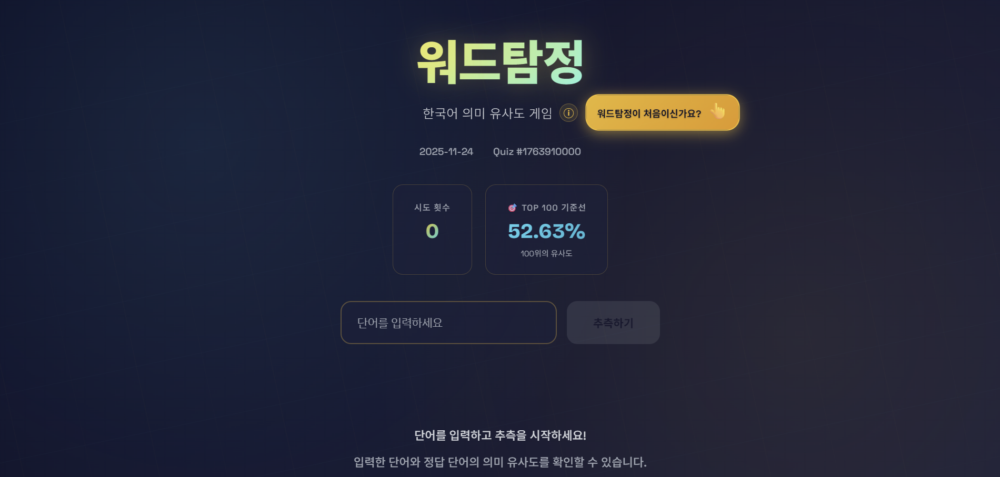
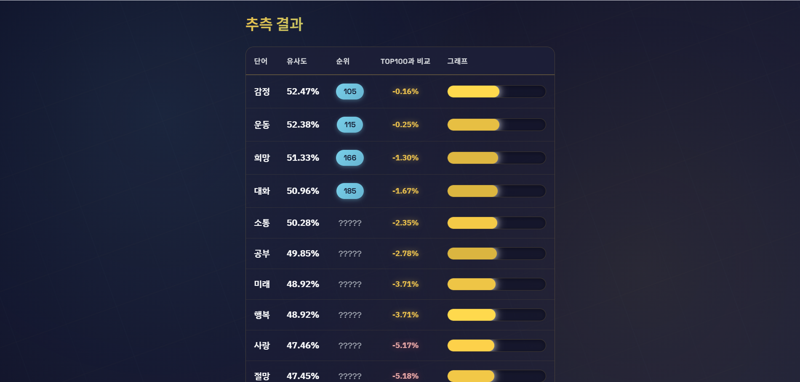

### WORDTAMJEONG - 한국어 의미 유사도 기반 단어 추측 게임

  <h1>WORDTAMJEONG - 한국어 의미 유사도 기반 단어 추측 게임</h1>
  
🧠 AWS Bedrock 기반 한국어 단어 추측 게임 🧠

 

  

 

  

 

  <a href="https://wordtamjeong-frontend.vercel.app/">홈페이지</a>

---

## ✍️ 프로젝트 개요

- **프로젝트명:** WORDTAMJEONG
- **프로젝트 기간:** 2025.11
- **프로젝트 형태:** 프로젝트
- **목표:** 한국어 단어 간 **의미 유사도**를 활용해, 사용자가 단어를 추측하면서 자연스럽게 단어 의미 공간을 탐색할 수 있는 게임
- **주요 타겟 사용자:**  
  - 한국어 Wordle / Semantle 류의 게임을 좋아하는 사용자  
  - AWS Bedrock 기반 임베딩/유사도 데모가 필요한 개발자

---

## ✍️ 프로젝트 소개

### 프로젝트 배경

기존 단어 게임들은 철자 일치나 단순 규칙 기반(예: 자리수, 알파벳 포함 여부)에 집중되어 있어  
**“의미가 비슷한 단어들끼리 얼마나 가까운가?”** 를 체감하기는 어려웠습니다.

또한, 영어권에는 Semantle 같은 의미 기반 단어 추측 게임이 있지만  
한국어에서는 **의미 유사도 기반 게임**을 체험할 수 있는 서비스가 많지 않습니다.

**WORDTAMJEONG**은 AWS Bedrock의 임베딩 모델을 활용해  
한국어 단어를 벡터 공간에 매핑하고,  
사용자가 입력한 단어와 정답 단어의 **코사인 유사도**를 기반으로  
얼마나 “가깝게” 맞추고 있는지를 직관적으로 보여주는 게임입니다.

---

## 🚀 프로젝트 목표

1. **의미 기반 단어 추측 경험 제공**  
   - 철자가 아닌 *의미*로 정답에 접근하는 새로운 방식의 단어 게임 제공  

2. **한국어 임베딩/벡터 검색 실험 플랫폼**  
   - AWS Bedrock 임베딩 모델(Titan / Cohere)을 활용한  
     한국어 의미 공간 실험 및 벡터 유사도 계산 구조 구현  

3. **운영 및 확장 고려한 구조 설계**  
   - 일별 정답 로테이션, 상위 유사 단어 집계, JSON 기반 히스토리 관리 등  
     향후 웹/앱 클라이언트 연동, 랭킹/통계 기능 확장을 고려한 설계

---

## 🧑‍💻 팀원 소개

| **이름** | **역할**         |
|:--------:|:----------------:|
| 김주호   | BE (Go 서버)     |
| 이동건   | FE (Vue.js 프론트)|

---

## ⚙️ 기술 스택

<table>
  <thead>
    <tr>
      <th>분류</th>
      <th>기술 스택</th>
    </tr>
  </thead>
  <tbody>
    <tr>
      <td>프론트엔드</td>
      <td>
        
        
        
        
      </td>
    </tr>
    <tr>
      <td>백엔드</td>
      <td>
        
        
      </td>
    </tr>
    <tr>
      <td>AWS &amp; AI</td>
      <td>
        
        
        
      </td>
    </tr>
    <tr> 
      <td>협업 &amp; 기타</td> 
      <td> 
         
         
      </td> 
    </tr>
  </tbody>
</table>

---
